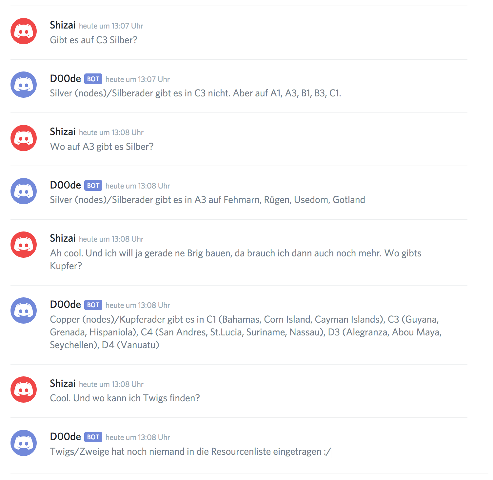

# LARB - little atlas resource bot

## Übersicht
LARB ist eine kleine Python(3) Applikation die als Chatbot für Discord dient. Der Hauptzweck ist die Abfrage einer Ressourcenliste aus Google Sheets über Chatnachrichten. Für die Interpretation der Chatnachrichten werden keine Commands verwendet, sondern NLP und Machine Learning. Der Bot ist demnach in der Lage, Fragen nach Ressourcen aus den Chatnachrichten zu "erkennen".

Der Bot ist kompatibel zur Resourcenliste der Radioactive Atlas Community - http://radioactiveatlas.com.


## Technik

Der Bot verwendet trainierte Machine Learning Modelle um Chatnachrichten zu analysieren. Kommt das ML-Modell zu dem Schluss, dass es sich bei der Nachricht um eine Frage nach Ressourcen handelt ("Wo finde ich Silber?"), wird die Ressourcenliste durchsucht, die Orte der betreffenden Ressource ermittelt und anschließend eine Chatnachricht mit dem Ergebnis abgeschickt.
Sofern das ML-Modell keine Frage nach Ressourcen erkennt ("Also in B3 gibt es Silber auf Formentera"), wird die Nachricht einfach ignoriert.

Zur Klassifikation wird eine Kombination aus `SGDClassifier` und einem Convolutional Neural Network verwendet.

## Installation
**Hinweis**    
LARB benötigt Python version 3.7. Die Verwendung eines Python-VirtualEnvironment wird empfohlen!

1) Installation der benötigten Python-Pakete:

```
$ pip install spacy discord scikit-learn google-api-python-client google-auth-httplib2 google-auth-oauthlib keras tensorflow pandas matplotlib
(...)
```
2) Laden des 'de_core_news_sm' Pakets für deutsche Sprachfeatures:

```
$ python -m spacy download de_core_news_sm
(...)
You can now load the model via spacy.load('de_core_news_sm')
```

3) LARB Git-Repository klonen:

```
$ git clone https://github.com/patrickjane/larb.git
(...)

$ ./larb/larb --help
LARB - little atlas resource bot version 1.1.0

Usage:
   $ larb [OPTIONS]

Options:
   --sheet-id=[ID]               Sets the google sheets ID to [ID]. This ID will be used to query resource data.
   --sheets-token-path=[PATH]    Storage path for google sheets access tokens.
   --sheets-credentials=[FILE]   Location of the google sheets credentials file.

   --discord-token=[FILE]        Location of a file containing the discord bot access token.
   --refresh-time=[TIME]         Interval in seconds after which the resource cache shall be reloaded from google sheets. Default is 600.
   
   --help                     Show this help and exit
   --console                  Log to stdout instead of a dedicated logfile

All options except train/help/console are MANDATORY.
```

## Verwendung
Der Chatbot benötigt folgende Parameter / Dateien:

- `--sheet-id` - Dies ist der Identifier des Google Sheets der als Quelle für Resourcen dient (z.b. `1Tu-kMkRgixJ2NInHSds0rJAHxYqD7hV84u8UbzQuZkI`)
- `--sheets-token-path` - Dies ist der Speicherort für den Google Sheets Access Token. Der Token wird während des Loginvorgangs automatisch angelegt, und kann jederzeit gelöscht werden.
- `--sheets-credentials` - Dies ist die Credentials-Datei die von Google Sheets erzeugt wurde (siehe https://developers.google.com/sheets/api/quickstart/python **Step 1**)
- `--discord-token` - Dies ist die Datei die den Access Token der von Discord bei der Erstellung des Bots erzeugt wurde enthält. Der Token muss der einzige Inhalt der Datei sein.
- `--cache-dir` - Dies ist der Speicherort für bereits geladene Ressourcendaten. Der Ordner dient als Cache, in dem die Daten zwischengespeichert werden, so dass diese nach dem Restart des Bots direkt bereit stehen, ohne dass erneut Google Sheets angefragt werden muss. Der Ordner kann jederzeit gelöscht werden.
- `--refresh-time` - Dies ist das Zeitintervall indem die Ressourcen erneut von Google Sheets geladen werden (in Sekunden). Der Defaultwert ist 600.

Beispiel:

```
$ larb --console --sheet-id=1Tu-kMkRgixJ2NInHSds0rJAHxYqD7hV84u8UbzQuZkI --cache-dir=./cache --sheets-token-path=./security/token.pickle --sheets-credentials=./security/credentials.json --discord-token=./security/token.txt --refresh-time=15
2019-07-13 12:29:29,423:main:INFO: Starting LARB v1.1.0
2019-07-13 12:29:29,423:main:INFO: Loading NLP module 'de_core_news_sm' ...
2019-07-13 12:29:29,799:main:INFO: Done.
2019-07-13 12:29:29,799:sheets:INFO: Reloading cache every 15 seconds
2019-07-13 12:29:29,799:sheets:INFO: Loading resource cache from filesytem ...
2019-07-13 12:29:29,810:sheets:INFO: Connecting ...
2019-07-13 12:29:29,810:sheets:INFO: Reusing existing authentication
2019-07-13 12:29:29,815:bot:INFO: Connecting to discord using discord.py v1.2.3 ...
2019-07-13 12:29:30,092:sheets:INFO: Connected.
2019-07-13 12:29:32,505:bot:INFO: Logged on as D00de
2019-07-13 12:29:45,109:sheets:INFO: Reloading sheets data cache ...
2019-07-13 12:29:46,337:sheets:INFO: Found sheets: Template, A1 (Tundra), A2 (Polar), A3 (Tundra)(FP), A4 (Tundra)(PVP), B1  (Temperate)
2019-07-13 12:29:48,407:sheets:INFO: Done reloading cache.
...
^C2019-07-13 12:29:52,099:main:INFO: Shutting down

```

Und so sieht das ganze in Discord aus:



# Copyright Hinweise
LARB verwendet die folgenden Libraries:

- `discord.py` - https://github.com/Rapptz/discord.py
- Google Sheets - https://developers.google.com/sheets/api/quickstart/python
- `spacy` - https://spacy.io/
- `scikit-learn` - https://scikit-learn.org
- tensorflow / keras - https://keras.io/
